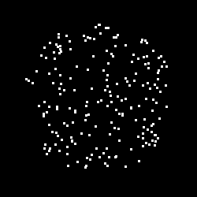
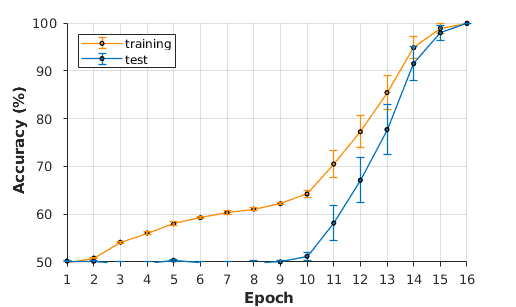
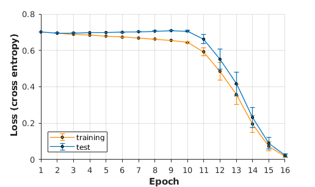
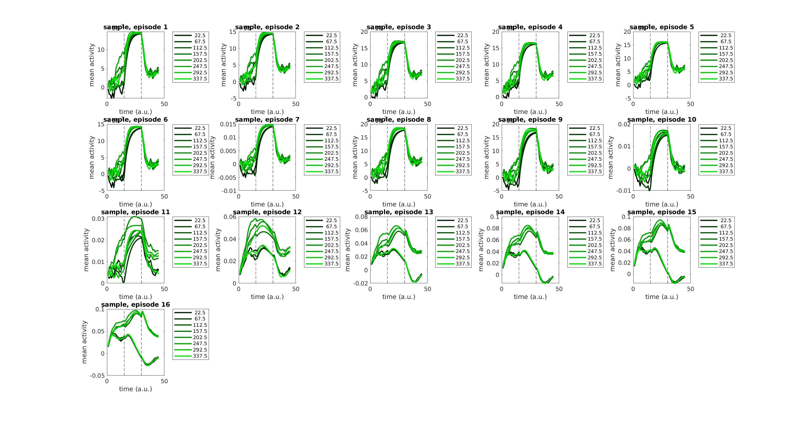
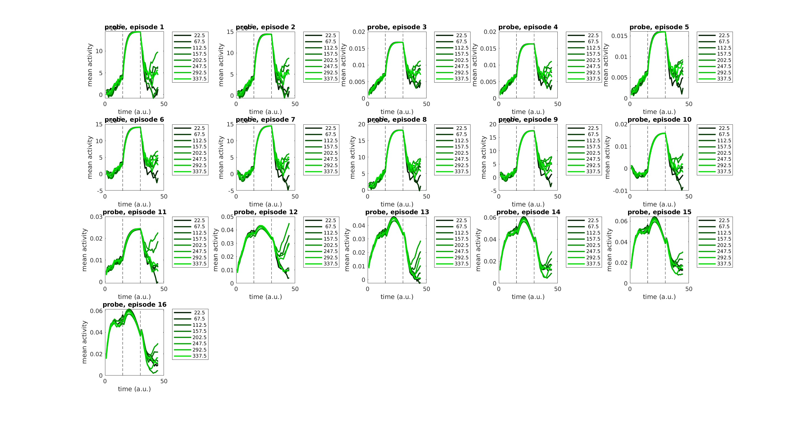
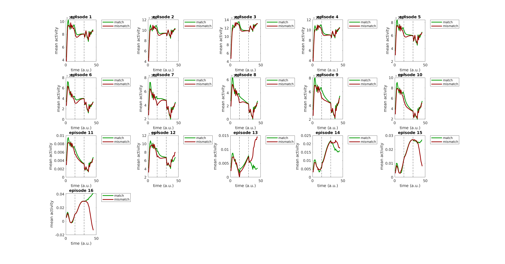
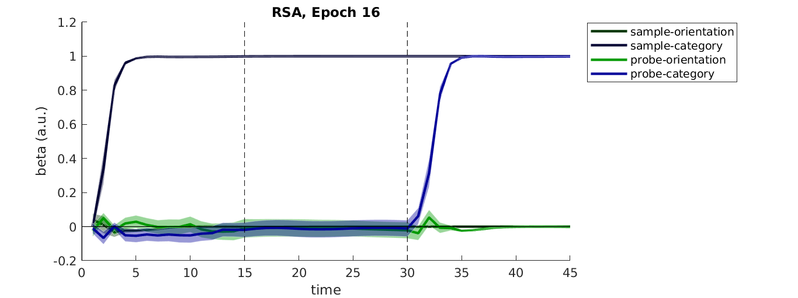

# LSTM on a Random Dot Motion Kinematogram
Training an LSTM on pixel inputs from a Delayed Match to Category (DMC) task.

This code trains an LSTM on a delayed match to category task. On each trial, the network receives two streams of randomly moving dots (100% coherence), separated by a brief inter stimulus interval. Hereafter, I refer to these two consecutively shown stimuli as **sample** and **probe**. The space of motion directions is divided into two halves, corresponding to two different "categories". The network has to perform a category match task, i.e. report whether or not the sample and probe belonged to the same category.    
The network is trained on pixel inputs, i.e. it receives brief videos of randomly moving dots as inputs.  
A typical stimulus would look like this:  
  

For a standalone version of my random dot motion task, have a look at [this repository (click me)](https://github.com/TimoFlesch/pygame_rdk).  

## Performance 
The network was trained in minibatch mode until convergence on training/test data:   
    
Here, accuracy is defined as correct classification (match or mismatch between the first and second random dot stimulus).  
  

## Representations of Sample Category
Below, I plot the average activity pattern recorded from the LSTM cell output at different timepoints of the trial. Subplots correspond to different training epochs. Coloured lines indicate the motion direction of the first stimulus. As can be seen from these plots, the network started to maintain only the category membership of the first stimulus. This is indicated by a collapse of the patterns into a binary code:
  
 
   

 ## Representations of Probe Category
 Similarly, the network encodes the category membership of the probe stimulus briefly after onset 
 

 ## Representation of Category Match vs Mismatch
 We can also ask whether the hidden layer patterns distinguished between category match and mismatch of the sample and probe: 
 
Indeed, the network responds differentially to match and mismatch trials

## Representational Similarity Analysis
Lastly, I tested whether the multivariate activity patterns read out from the network would in general encode category information. To test this, I collected several independent runs for which I varied the orientation of the category boundary. I used Representational Similarity Analysis (RSA) to probe for the existence of category-discriminating codes in the activity patterns:
 
As expected, there is clear evidence for encoding of the sample category, which is maintained throughout the delay interval, until it can be matched against the representation of the probe category.

